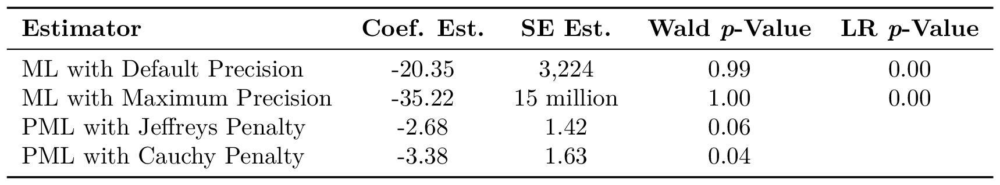

# Question

Previous research suggests using penalized maximum likelihood for dealing with separation in logistic regression models (Zorn 2005), but notes that the penalty is a meaningful, substantive decision (Rainey 2016). In the project I show that researchers can use the likelihood ratio to compute reasonable, well-behaved *p*-values without using frequentist penalties or prior information.

# Key Figures and Tables

# Raw Data

The project uses two data sets discussed from previous research. 

- `politics_and_need_rescaled.csv` comes from [Barrilleaux and Rainey (2014)](http://www.carlislerainey.com/papers/need.pdf) and their [replication files on Dataverse](https://dataverse.unc.edu/dataset.xhtml?persistentId=doi:10.15139/S3/12130).
- `bm.csv` comes from [Bell and Miller (2015)](https://journals.sagepub.com/doi/abs/10.1177/0022002713499718) and the [replication files on Dataverse](https://dataverse.harvard.edu/dataset.xhtml?persistentId=doi:10.7910/DVN/VW7G2Q) for [Rainey (2016)](http://www.carlislerainey.com/papers/separation.pdf).

# Project Progress

## Completed Tasks

- [x] Obtain raw data.
- [x] Wrangle the raw data into a usable format consistent with Broman and Woo (2018).

## Immediate Next Steps

- [ ] Complete manuscript section on the theory of hypothesis tests.

## Someday/Maybe

- [ ] Perform MC simulations for a general logistic regression.
